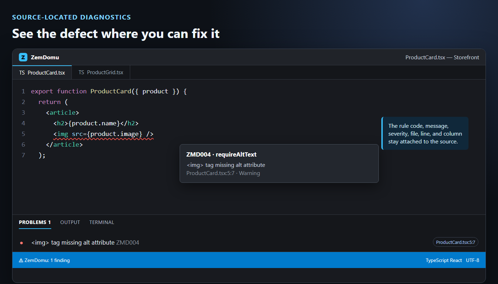
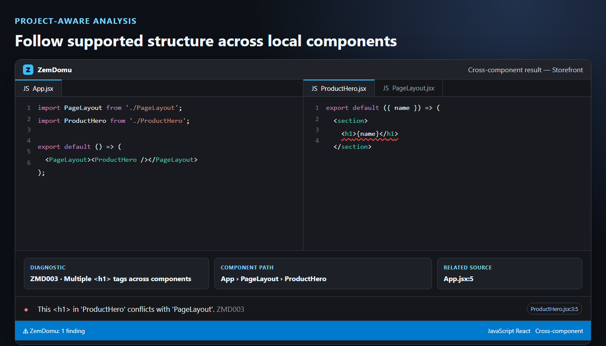
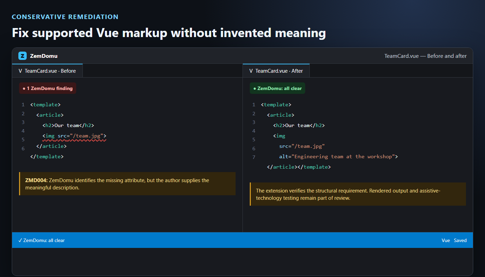

# ZemDomu — Semantic Accessibility Diagnostics for VS Code

> Find semantic HTML and accessibility defects in HTML, JSX, TSX, React, and
> Vue source before they become CI failures or late audit findings.

Most editor linters stop at one file. ZemDomu reports source-located diagnostics
inline and in the Problems panel, then follows supported local component
composition to expose structural conflicts hidden behind imports. It provides
WCAG context without claiming conformance.

## Try It in Under a Minute

1. Install [**ZemDomu** from the VS Code Marketplace](https://marketplace.visualstudio.com/items?itemName=ZachariasErydBerlin.zemdomu).
2. Open any `.html`, `.jsx`, `.tsx`, or `.vue` file.
3. Save the file, or run
   `ZemDomu: Scan Workspace for Semantic Accessibility Issues`
   (`Ctrl+Alt+Z` / `Cmd+Alt+Z`).

For example, save this as `ProductCard.tsx`:

```tsx
export function ProductCard({ product }) {
  return ;
}
```

ZemDomu reports `ZMD004:  tag missing alt attribute` at the source line.



## Why ZemDomu

ZemDomu complements file-oriented source linting and rendered-DOM testing with
project-aware semantic structure analysis while you code.

- Focused semantic diagnostics for document structure, accessible names, and landmarks.
- Consistent rule behavior with ZemDomu Core and the ZemDomu GitHub Action.
- Supported cross-component analysis across statically resolvable React and
  Vue imports.
- Built-in quick fixes for common remediation paths.



## Features

- Lints HTML, JSX, TSX, and Vue templates with semantic rules.
- Runs on save, on type, or manually.
- Workspace scan command and status bar finding count.
- Cross-component JSX and Vue analysis.
- Quick fixes for common missing attributes and semantic issues.
- Optional verbose logging and performance diagnostics.

## From Finding to Fix

ZemDomu identifies supported structural requirements without inventing the
author's meaning. When a fix needs a human-readable label, description, ARIA
state, or hierarchy decision, you supply that intent and then scan again.



## Scope and Limitations

ZemDomu analyzes source markup; it cannot establish WCAG conformance. Use it
alongside rendered-DOM testing, keyboard review, browser accessibility tools,
and assistive-technology testing. Runtime state, CSS, dynamic or bound values,
conditional rendering, and slotted content can change the accessible result
after static analysis.

Linting runs locally in the VS Code Extension Host. ZemDomu does not transmit
source files or diagnostics. Diagnostic documentation links open only when you
choose to follow them.

## Configuration

Settings are under the `zemdomu` namespace.

### Run Mode

```json
"zemdomu.run": "onSave"
```

Options: `onSave`, `onType`, `manual`, `disabled`.

### Cross-Component Analysis

```json
"zemdomu.crossComponentAnalysis": true,
"zemdomu.crossComponentDepth": 50
```

In multi-root workspaces, each folder is analyzed independently as its own
project root. Files outside a workspace folder are linted without
cross-component analysis.

### Logging and Diagnostics

```json
"zemdomu.devMode": false,
"zemdomu.enableVerboseLogging": false
```

`devMode` enables the `ZemDomu Perf` output channel. `enableVerboseLogging`
adds structured lifecycle logs to the `ZemDomu` output channel.

### Supported Rules

Enable or disable individual rules:

```json
"zemdomu.rules.requireAltText": true,
"zemdomu.rules.enforceHeadingOrder": true
```

Override severity per rule:

```json
"zemdomu.severity.requireAltText": "warning",
"zemdomu.severity.enforceHeadingOrder": "error"
```

- `requireSectionHeading`
- `enforceHeadingOrder`
- `singleH1`
- `requireAltText`
- `requireLabelForFormControls`
- `enforceListNesting`
- `requireLinkText`
- `requireTableCaption`
- `preventEmptyInlineTags`
- `requireHrefOnAnchors`
- `requireButtonText`
- `requireIframeTitle`
- `requireHtmlLang`
- `requireImageInputAlt`
- `requireNavLinks`
- `uniqueIds`
- `noTabindexGreaterThanZero`
- `preventZemdomuPlaceholders`
- `requireDocumentTitle`
- `requireSingleMain`
- `ariaValidAttrValue`
- `requirePageH1`

### Heading Rules

`enforceHeadingOrder` warns when a later heading skips upward levels, such as
`<h3>` after `<h1>`. The first heading observed does not warn.

`singleH1` is a house-style rule that warns about additional `<h1>` elements;
it does not require a page to contain an `<h1>`. The current VS Code Extension
therefore does not report a missing first or page-level `<h1>`.

## Inline Disabling

```html
<!-- zemdomu-disable-next -->
<!-- zemdomu-disable -->
<!-- zemdomu-enable -->
```

```jsx
{/* zemdomu-disable-next */}
```

Disable controls work in HTML, JSX/TSX, and Vue templates. Block controls apply
from `zemdomu-disable` through `zemdomu-enable`, and all diagnostics on a
disabled line are suppressed.

`singleH1` and `requireNavLinks` are house-style rules. `requireTableCaption`
and `requireSectionHeading` are advisory by default; enable or elevate them
when a specific project or conformance requirement calls for that policy.

## Local Development

From the extension package:

```bash
cd packages/ZemDomu-Extension
npm install
npm test
```

For run-mode details, framework limitations, troubleshooting, privacy, and
performance diagnostics, see the packaged [user guide](docs/USER_GUIDE.md).

## Links

- Extension page: https://marketplace.visualstudio.com/items?itemName=ZachariasErydBerlin.zemdomu
- Issues and suggestions: https://github.com/ZemDomu/ZemDomu-extension/issues
- ZemDomu Core: https://www.npmjs.com/package/zemdomu
- Website and docs: https://zemdomu.dev/

## License

MIT (c) 2025 Zacharias Eryd Berlin
